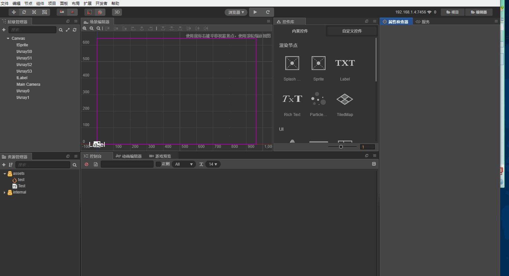

# CC-AutpProperty
 auto bind property for cocos creator

* 导入autoproperty 到你的packages 中
* 给你的脚本添加自定义inspector  @inspector("packages://autoproperty/inspector.js")
* 在你的脚本中定义属性 属性名与子节点同名时， 在点击自动绑定按钮时会自动关联属性
* 使用注意项 Array 后缀0 开始

